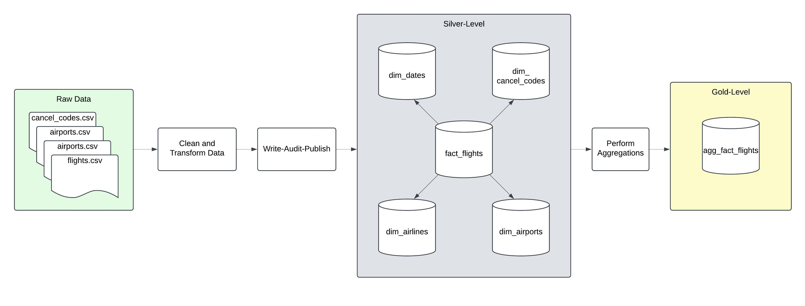
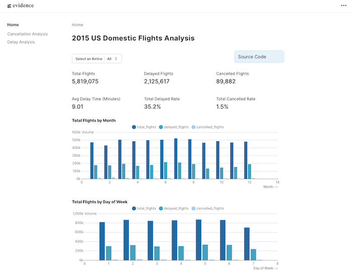
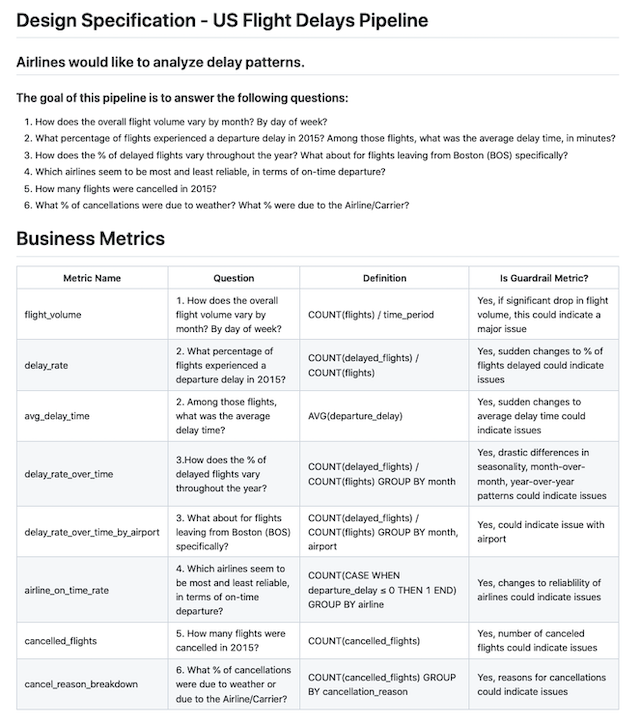
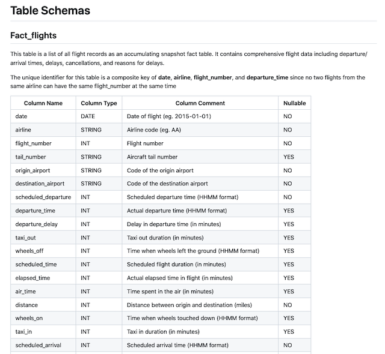

# Airline Flights Pipeline

[View the Interactive Dashboard Here!](https://phamlamn.github.io/airline-flights-pipeline/)

## Table of Contents
- [Overview](#overview)
- [Features](#features)
- [Pipeline Architecture](#pipeline-architecture)
- [Example Dashboard](#example-dashboard)
- [Design Specification](#design-specification)
- [Data Sources](#data-sources)
- [Challenges Addressed](#challenges-addressed)
- [Getting Started](#getting-started)
  - [Prerequisites](#prerequisites)
  - [Installation](#installation)
  - [Running the Pipeline](#running-the-pipeline)
- [Future Enhancements](#future-enhancements-and-next-steps)
- [Contribution](#contribution)
- [License](#license)
- [Contact](#contact)

## Overview

The **Airline Flights Pipeline** project is an end-to-end ETL (Extract, Transform, Load) solution designed to process and analyze US flight data efficiently. Utilizing cutting-edge tools like **Apache Spark** and **Apache Iceberg**, this pipeline ensures robust data processing, quality checks, and insightful visualizations through an analytics dashboard.

## Features
- **Data Processing**: Processes, cleans, and enriches data using **Apache Spark**.
- **Data Storage**: Leverages **Apache Iceberg** on top of local object storage with **MinIO** for scalable and efficient data storage.
- **Data Quality Checks**: Ensures data accuracy, completeness, and consistency using **PyDeequ**.
- **Write-Audit-Publish**: Implements a WAP pattern to guarantee only high-quality data is ever exposed to downstream consumers.
- **Unit Testing**: Includes unit tests with **Chispa** for Spark DataFrames to ensure pipeline robustness.
- **Reduced Table Size**: Optimized storage, reducing data sizes from ~600MB (Raw) to 120MB (Silver) to 0.3MB (Gold) for aggregated view.
- **Business-Intelligence-as-Code**: Uses **Evidence.dev** to create a static BI site, built with GitHub Actions and hosted for free on GitHub Pages.
- **Containerization**: Uses **Docker-Compose** for easy deployment and environment consistency.

## Pipeline Architecture


### Key Steps in the Pipeline:
1. **Data Extraction**: Ingests raw data from external sources.
2. **Data Transformation**: Cleans and enriches the data using Apache Spark.
3. **Data Loading**: Stores the processed data into Apache Iceberg tables (staging branches).
4. **Data Quality Checks**: Validates the data during Write-Audit-Publish, prior to publishing staged data only if validations pass.
5. **Visualization**: Presents insights via an interactive dashboard.

## Example Dashboard


## Design Specification
Ensures proper design and can be validated by stakeholders prior to implementation. For more details, refer to the [Design Specification](docs/Design_Specification.md).




## Data Sources
This project uses publicly available [US Domestic Flight Data](https://www.kaggle.com/datasets/usdot/flight-delays) from the US Department of Transportation (DOT). Data includes:
- Flight schedules
- Delays and cancellations
- Airport and airline metadata

## Challenges Addressed
- Handling large-scale data efficiently using distributed processing (Spark).
- Maintaining data integrity with quality checks.
- Optimizing storage and query performance with Iceberg.
- Building user-friendly dashboards for non-technical stakeholders.

## Getting Started
### Prerequisites
Ensure the following tools and libraries are installed:
- Docker Compose

### Installation
1. Clone the repository:
   ```bash
   git clone https://github.com/phamlamn/airline-flights-pipeline.git
   cd airline-flights-pipeline
    ```

2. Set up the environment:
    ```sh
    cp example.env .env
    ```

3. Build and start the Docker containers:
    ```sh
    docker-compose up -d
    ```

### Running the Pipeline
1. Run the ETL pipeline from within the Spark-Iceberg container:
    ```sh
    docker exec -it spark-iceberg-flights python /home/iceberg/src/jobs/etl_pipeline.py
    ```

## Future Enhancements and Next Steps
##### Data Integration
- Expand historical coverage by incorporating more years from Kaggle datasets.
- Integrate additional data sources, including weather data.

##### Pipeline Optimization
- Enable direct ingestion of raw data from US DOT BTS sources.
- Refactor the pipeline to adopt an incremental processing approach.

##### Scalability and Orchestration
- Deploy the solution to a cloud environment for scalability.
- Add support for orchestration tools like Dagster or Airflow.

##### Automation and DataOps
- Implement a CI/CD pipeline for automated deployment and testing.
- Introduce DataOps tools such as SQL Mesh or DBT for better data management and governance.

## Contact
For questions or feedback, please contact:
- **Name**: Lam Pham
- **LinkedIn**: [LinkedIn Profile](https://www.linkedin.com/in/lam-pham-71105522b/)

---
Thank you for exploring the **Airline Flights Pipeline** project! Feel free to dive into the code and contribute to its development.
