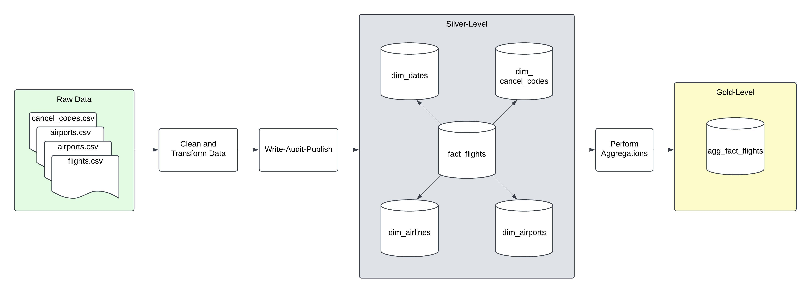

# Design Specification - US Flight Delays Pipeline

<aside>
## **Airlines would like to analyze delay patterns.**

### The goal of this pipeline is to answer the following questions:

1. How does the overall flight volume vary by month? By day of week?
2. What percentage of flights experienced a departure delay in 2015? Among those flights, what was the average delay time, in minutes?
3. How does the % of delayed flights vary throughout the year? What about for flights leaving from Boston (BOS) specifically?
4. Which airlines seem to be most and least reliable, in terms of on-time departure?
5. How many flights were cancelled in 2015?
6. What % of cancellations were due to weather? What % were due to the Airline/Carrier?
</aside>

# Business Metrics

| Metric Name | Question | Definition | Is Guardrail Metric? |
| --- | --- | --- | --- |
| flight_volume | 1. How does the overall flight volume vary by month? By day of week? | COUNT(flights) / time_period | Yes, if significant drop in flight volume, this could indicate a major issue |
| delay_rate | 2. What percentage of flights experienced a departure delay in 2015? | COUNT(delayed_flights) / COUNT(flights) | Yes, sudden changes to % of flights delayed could indicate issues |
| avg_delay_time | 2. Among those flights, what was the average delay time? | AVG(departure_delay) | Yes, sudden changes to average delay time could indicate issues |
| delay_rate_over_time | 3.How does the % of delayed flights vary throughout the year? | COUNT(delayed_flights) / COUNT(flights) GROUP BY month | Yes, drastic differences in seasonality, month-over-month, year-over-year patterns could indicate issues |
| delay_rate_over_time_by_airport | 3. What about for flights leaving from Boston (BOS) specifically? | COUNT(delayed_flights) / COUNT(flights) GROUP BY month, airport | Yes, could indicate issue with airport |
| airline_on_time_rate | 4. Which airlines seem to be most and least reliable, in terms of on-time departure? | COUNT(CASE WHEN departure_delay ≤ 0 THEN 1 END) GROUP BY airline | Yes, changes to reliablility of airlines could indicate issues |
| cancelled_flights | 5. How many flights were cancelled in 2015? | COUNT(cancelled_flights) | Yes, number of canceled flights could indicate issues |
| cancel_reason_breakdown | 6. What % of cancellations were due to weather or due to the Airline/Carrier? | COUNT(cancelled_flights) GROUP BY cancellation_reason | Yes, reasons for cancellations could indicate issues |

# Flow Diagram

# Table Schemas

## Fact_flights

This table is a list of all flight records as an accumulating snapshot fact table. It contains comprehensive flight data including departure/arrival times, delays, cancellations, and reasons for delays.

The unique identifier for this table is a composite key of **date**, **airline**, **flight_number**, and **departure_time** since no two flights from the same airline can have the same flight_number at the same time

| Column Name | Column Type | Column Comment | Nullable |
| --- | --- | --- | --- |
| date | DATE | Date of flight (eg. 2015-01-01) | NO |
| airline | STRING | Airline code (eg. AA) | NO |
| flight_number | INT | Flight number | NO |
| tail_number | STRING | Aircraft tail number | YES |
| origin_airport | STRING | Code of the origin airport | NO |
| destination_airport | STRING | Code of the destination airport | NO |
| scheduled_departure | INT | Scheduled departure time (HHMM format) | NO |
| departure_time | INT | Actual departure time (HHMM format) | YES |
| departure_delay | INT | Delay in departure time (in minutes) | YES |
| taxi_out | INT | Taxi out duration (in minutes) | YES |
| wheels_off | INT | Time when wheels left the ground (HHMM format) | YES |
| scheduled_time | INT | Scheduled flight duration (in minutes) | YES |
| elapsed_time | INT | Actual elapsed time in flight (in minutes) | YES |
| air_time | INT | Time spent in the air (in minutes) | YES |
| distance | INT | Distance between origin and destination (miles) | NO |
| wheels_on | INT | Time when wheels touched down (HHMM format) | YES |
| taxi_in | INT | Taxi in duration (in minutes) | YES |
| scheduled_arrival | INT | Scheduled arrival time (HHMM format) | NO |
| arrival_time | INT | Actual arrival time (HHMM format) | YES |
| arrival_delay | INT | Delay in arrival time (in minutes) | YES |
| diverted | INT | Whether the flight was diverted (0 or 1) | NO |
| cancelled | INT | Whether the flight was cancelled (0 or 1) | NO |
| cancellation_reason | STRING | Reason for cancellation (A, B, C, D) | YES |
| air_system_delay | INT | Delay due to air system (in minutes) | YES |
| security_delay | INT | Delay due to security (in minutes) | YES |
| airline_delay | INT | Delay caused by airline operations (minutes) | YES |
| late_aircraft_delay | INT | Delay caused by late aircraft (in minutes) | YES |
| weather_delay | INT | Delay caused by weather (in minutes) | YES |
| is_delayed | INT | Whether the flight experienced departure delay (0 or 1) | YES |

### Quality Checks:

Unique on:

- date
- airline
- flight_number
- scheduled_departure

Non-Nulls:

- date
- airline
- flight_number
- origin_airport
- destination_airport
- scheduled_departure
- scheduled_arrival
- distance
- diverted
- cancelled
- is_delayed

Non-Negative Values:

- flight_number
- scheduled_departure
- departure_time
- taxi_out
- wheels_off
- scheduled_time
- elapsed_time
- air_time
- distance
- wheels_on
- taxi_in
- arrival_time
- air_system_delay
- security_delay
- airline_delay
- late_aircraft_delay

Quantitative:

- Total flights = `# Cancelled flights`  + `# Nulls in cancellation reason (Not cancelled)`
- Departure delay = SUM(`{reason}_delay`)

---

## Dim_cancellation_codes

This dimension table contains the mapping between cancellation reason codes and their descriptions.

The unique identifier for this table is **cancellation_reason.**

| Column Name | Column Type | Column Comment | Nullable |
| --- | --- | --- | --- |
| cancellation_reason | STRING | Code indicating reason for cancellation (A, B, C, D) | NO |
| cancellation_description | STRING | Description of the cancellation reason | NO |

### Quality Checks:

Not Null:

- cancellation_reason
- cancellation_description

Unique:

- cancellation_reason

Valid Values:

- cancellation_reason in ('A','B','C','D')

---

## Dim_dates

This dimension table contains the mapping between dates and their various components for time-based analysis.

The unique identifier for this table is **date** since each record represents a unique calendar date.

| Column Name | Column Type | Column Comment | Nullable |
| --- | --- | --- | --- |
| date | DATE | Calendar date (eg. 2015-01-01) | NO |
| year | INT | Year component of date | NO |
| month | INT | Month component of date (1-12) | NO |
| day | INT | Day component of date (1-31) | NO |
| day_of_week | INT | Day of week (1=Sunday, 7=Saturday) | NO |
| quarter | INT | Quarter of the year (1-4) | NO |
| holiday_name | STRING | Name of holiday if applicable | YES |
| is_holiday | BOOLEAN | Whether the date is a holiday | NO |

### Quality Checks:

Not Null:

- date
- year
- month
- day
- day_of_week
- quarter
- is_holiday

Unique:

- date

Valid Values:

- month between 1 and 12
- day between 1 and 31
- day_of_week between 1 and 7
- quarter between 1 and 4

---

## Dim_airlines

This dimension table contains airline codes and names for mapping between the carrier code and full airline name.

The unique identifier for this table is **iata_code** since each record represents a unique airline carrier.

| Column Name | Column Type | Column Comment | Nullable |
| --- | --- | --- | --- |
| iata_code | STRING | IATA airline code (eg. AA, DL) | NO |
| airline | STRING | Full name of the airline | NO |

### Quality Checks:

Not Null:

- iata_code
- airline

Unique:

- iata_code

Valid Values:

- iata_code matches pattern '[A-Z]{2}'

---

## Dim_airports

This dimension table contains information about airports, including their locations and identifying codes.

The unique identifier for this table is **iata_code** since each record represents a unique airport location and its associated details.

| Column Name | Column Type | Column Comment | Nullable |
| --- | --- | --- | --- |
| iata_code | STRING | IATA airport code (eg. LAX, JFK) | NO |
| airport | STRING | Full name of the airport | NO |
| city | STRING | City where airport is located | NO |
| state | STRING | State where airport is located | NO |
| country | STRING | Country where airport is located | NO |
| latitude | FLOAT | Geographical latitude coordinate | NO |
| longitude | FLOAT | Geographical longitude coordinate | NO |

### Quality Checks:

Not Null:

- iata_code
- airport
- city
- state
- country
- latitude
- longitude

Unique:

- iata_code

Valid Values:

- iata_code matches pattern '[A-Z]{3}'
- latitude between -90 and 90
- longitude between -180 and 180

---

## Agg_fact_flights

This aggregation table contains flight metrics aggregated at different levels (yearly, monthly, day_of_week) and grouped by different dimensions (airline, airport, etc.) to support various analytical queries about delays, cancellations, and flight volumes.

Includes metrics such as:

- Total flight counts and volume patterns
- Delay statistics including delay rates and average delay durations
- Cancellation metrics broken down by reason codes (A=Carrier, B=Weather, C=National Air System, D=Security)

Contains multiple aggregation levels to enable flexible analysis:

- Time-based levels: Yearly, monthly, and day-of-week trends
- Dimensional levels: Overall metrics, airline specific, and origin airport specific analysis

The unique identifier for this table is a composite key consisting of all dimensions and agg_levels (ie. **year, month, day_of_week, airline, origin_airport, time_agg_level, agg_level**). This combination uniquely identifies each aggregation record and reflects the multi-level nature of the aggregations stored in this table.

Note, adding new aggregation metrics can be accomplished by simply adding additional columns for the dimensions and appending new records for the aggregations. As existing records are not aggregated on the new dimensions, we can set this column to null for existing records. This is a non-breaking change.

| Column Name | Column Type | Column Comment | Nullable |
| --- | --- | --- | --- |
| year | INT | The year of the aggregated data. | YES |
| month | INT | The month of the aggregated data. Null if not applicable to the aggregation level. | YES |
| day_of_week | INT | The day of the week for the aggregated data (1 = Sunday, 7 = Saturday). Null if not applicable to the aggregation level. | YES |
| airline | STRING | The airline code associated with the aggregated data. Null if aggregation is not airline-specific. | YES |
| origin_airport | STRING | The origin airport code for the aggregated data. Null if aggregation is not airport-specific. | YES |
| total_flights | BIGINT | The total number of flights during the aggregation period. | NO |
| delayed_flights | BIGINT | The total number of delayed flights during the aggregation period. | NO |
| delay_rate | DOUBLE | The percentage of delayed flights relative to the total flights for aggregation period. | NO |
| avg_delay_time | DOUBLE | The average delay time (in minutes) for delayed flights during the aggregation period. | NO |
| cancelled_flights | BIGINT | The total number of cancelled flights during the aggregation period. | NO |
| cancelled_rate | DOUBLE | The percentage of cancelled flights relative to the total flights. | NO |
| cancellations_A | BIGINT | The number of cancellations due to reason A during the aggregation period. | NO |
| cancellations_B | BIGINT | The number of cancellations due to reason B during the aggregation period. | NO |
| cancellations_C | BIGINT | The number of cancellations due to reason C during the aggregation period. | NO |
| cancellations_D | BIGINT | The number of cancellations due to reason D during the aggregation period. | NO |
| percent_cancellations_A | DOUBLE | The percentage of cancellations due to reason A relative to the total cancellations during aggregation period. Null if not applicable. | YES |
| percent_cancellations_B | DOUBLE | The percentage of cancellations due to reason B relative to the total cancellations during aggregation period. Null if not applicable. | YES |
| percent_cancellations_C | DOUBLE | The percentage of cancellations due to reason C relative to the total cancellations during aggregation period. Null if not applicable. | YES |
| percent_cancellations_D | DOUBLE | The percentage of cancellations due to reason D relative to the total cancellations during aggregation period. Null if not applicable. | YES |
| time_agg_level | STRING | The time granularity for the aggregation. Possible values: all, year, year_month, day_of_week. | NO |
| agg_level | STRING | The dimension for grouping the aggregation. Possible values: all, airline, origin_airport. | NO |

### Quality Checks:

Not-Null:

- total_flights
- delayed_flights
- cancelled_flights
- cancellations_A
- cancellations_B
- cancellations_C
- cancellations_D
- time_agg_level
- agg_level

Valid Values:

- month between 1 and 12
- day_of_week between 1 and 7
- time_agg_level in (’all’, 'year', 'year_month', 'day_of_week')
- agg_level in ('all', 'airline', 'origin_airport')

Unique:

- year
- month
- day_of_week
- airline
- origin_airport
- time_agg_level
- agg_level

Non-Negative:

- total_flights
- delayed_flights
- delayed_rate
- cancelled_flights
- cancelled_rate
- cancellations_{A-D}
- percent_cancellations_{A-D}

Quantitative:

- `# Cancelled_flights` = `cancellation_A` + `…` + `cancellation_d`
- 100% = `percent_cancellations_A` + `…` + `percent_cancellations_D`
- `delayed_flights` ≤ `total_flights`
- `cancelled_flights` ≤ `total_flights`
- 0 ≤ `delay_rate` ≤ 1
- 0 ≤ `cancelled_rate` ≤ 1
- 0 ≤ `{percentage_columns}` ≤ 1